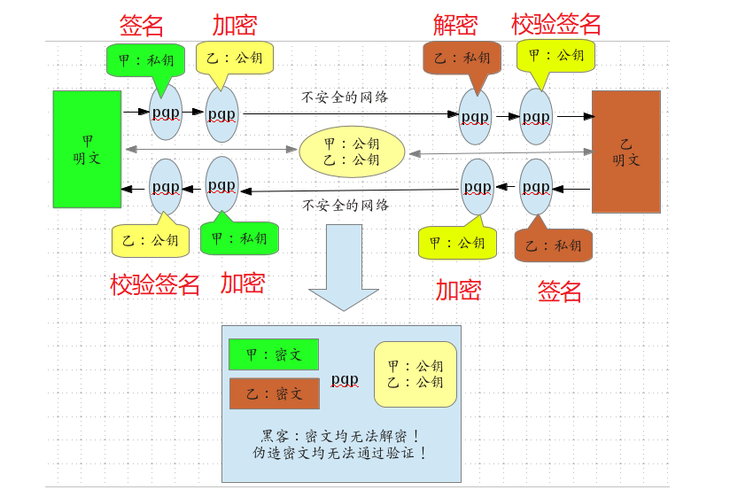
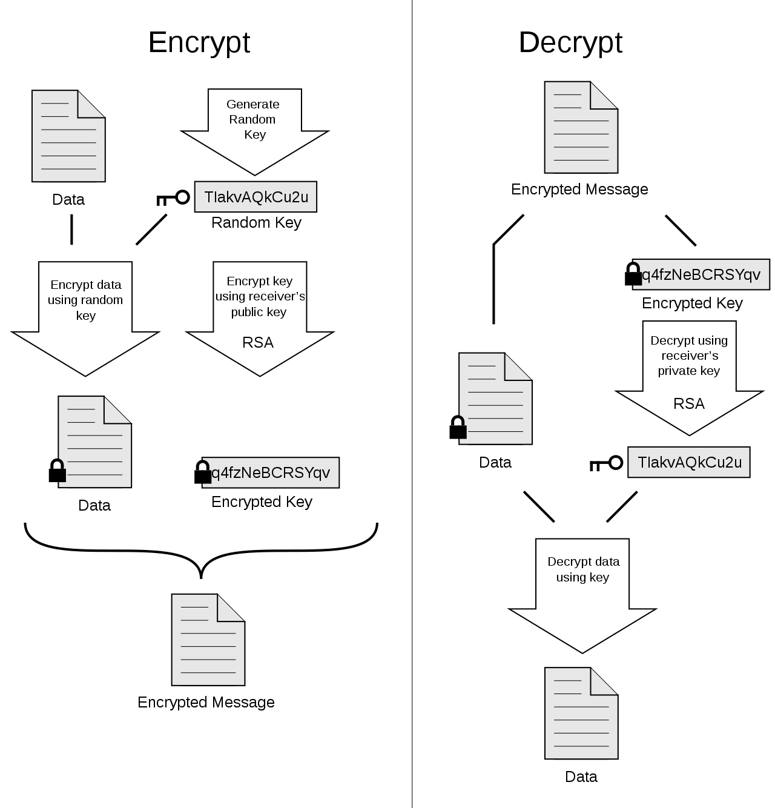

# GnuPG/GPG


* **GNU Privacy Guard（GnuPG或GPG）**是一个密码学软件，用于加密、签名通信内容及管理非对称密码学的密钥。GnuPG是自由软件，遵循IETF订定的OpenPGP技术标准设计，并与PGP保持兼容。
* GnuPG是自由软件基金会的GNU计划的一部分，曾受德国政府资助。


## 本仓库内容

1. GnuPG/GPG学习笔记

```
Something I hope you know before go into the coding~
First, please watch or star this repo, I'll be more happy if you follow me.
Bug report, questions and discussion are welcome, you can post an issue or pull a request.
```

## 目录


## 参考





