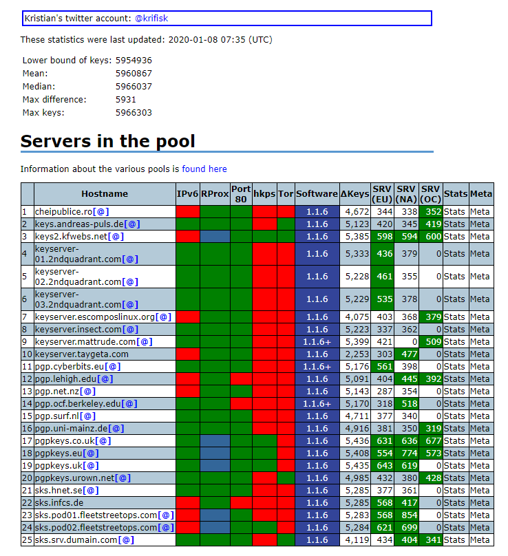

# GPG公共服务器列表

附：PGP公钥服务器列表：

```
http://keyserver.ubuntu.com
http://keys.gnupg.net
hkp://subkeys.pgp.net
hkp://pgp.mit.edu
hkp://pool.sks-keyservers.net
hkp://zimmermann.mayfirst.org
```

* <https://sks-keyservers.net/status/> 该站点统计其他站点的公钥数目

 
