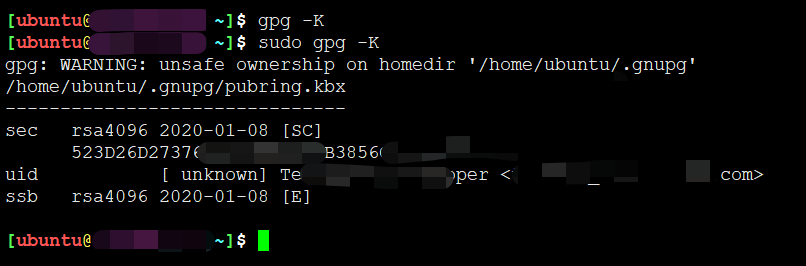

# gpg --export导出公私钥


## --export 导出公钥

公钥文件（.gnupg/pubring.gpg）以二进制形式储存，**armor参数可以将其转换为ASCII码显示**。

```
gpg --armor --output ~/public-key.txt --export [秘钥标识]
```

"秘钥标识"指定哪个公钥，output参数指定输出文件名（public-key.txt）。


## --export-scret-keys 导出私钥

类似地，export-secret-keys参数可以转换私钥。

```
gpg --armor --output ~/private-key.txt --export-secret-keys
```

打开public-key.txt private-key.txt 就能看到公钥和私钥了。

## --import 导入公钥

```
sudo gpg --import ~/public-key.txt
```

## --allow-secret-key-import 导入私钥

```
sudo gpg --allow-secret-key-import --import ~/private-key.txt
```

默认公钥都可以访问，私钥只有root才能get到




除了生成自己的密钥，还需要将他人的公钥或者你的其他密钥输入系统。这时可以使用import参数。


为了获得他人的公钥，可以让对方直接发给你，或者到**公钥服务器**上寻找。

gpg --keyserver hkp://subkeys.pgp.net --search-keys [KEY标识]

* 正如前面提到的，我们无法保证服务器上的公钥是否可靠，下载后还需要用其他机制验证．
* KEY标识存在碰撞的可能


## 参考

* <https://gythialy.github.io/Howto-import-export-gpg-key/>
* <https://www.ruanyifeng.com/blog/2013/07/gpg.html>
